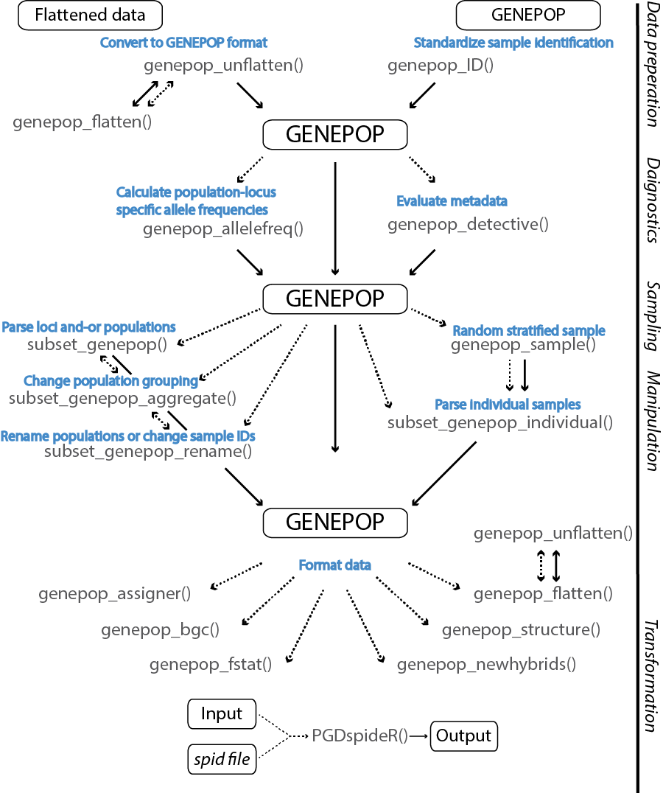

#genepopedit

The goal of **genepopedit** is to provide a simple and flexible tool for manipulating large multi-locus genotype datasets in R. 

**Use genepopedit to subset a SNP dataset by:**

* removing specified loci.

* removing specified populations. 

* removing specified individuals.

* renaming populations. 

* grouping populations.

* extracting meta-data:
    * population names.
    * population counts.
    * sample IDs.
    * loci names.
    * allele calls.
    
* create datasets for training, assignment, and outlier detection, according to a population stratified random sample. 

* convert Genepop to STRUCTURE, fstat, New Hybrids, assigner, BGC, and flattened format.

***



__Fig 1.__ **genepopedit** *workflow including data preparation, diagnostics, manipulation and transformation. Files, functions, and function operations are denoted by black, grey and blue text, respectively. Function inputs and outputs are denoted by dashed and solid lines, respectively.*

***
**Requirement:**
genepopedit functions through the manipulation of multi-locus SNP files structured in the *Genepop* file format <http://genepop.curtin.edu.au/>. Specifically, we use the _three number_ format (e.g. 110110) where the six digits correspond to the alleles of a given locus for an individual. Locus names can be listed in the first row separated by columns or each on their own row so that the total number of rows in the _Genepop_ file equals: 

    nrows = nLOCI + nINDIVIDUALS + nPOPULATIONS - 1
    
  _or_
  
    nrows* = nLOCI + nINDIVIDUALS + nPOPULATIONS 
    
_* if STACKS version is not specified_

**For example:**

*A three locus dataset with two populations and four individuals per population with the STACKS version specified*

    STACKS Version 1.0
    Loci_1
    Loci_2
    Loci_3
    Pop
    BON_01  , 120120 110110 110110
    BON_02  , 100100 110110 110110
    BON_03  , 100100 110110 110110
    BON_04  , 100100 110110 110110
    Pop
    TAG_01  , 120120 110110 110110
    TAG_02  , 120120 110110 110110
    TAG_03  , 120120 110110 110110
    TAG_04  , 120120 110110 110110

Alternatively the loci names can be read in the first row as a single character separated by commas. 

    Loci_1,Loci_2,Loci,3
    Pop
    BON_01  , 120120 110110 110110
    BON_02  , 100100 110110 110110
    BON_03  , 100100 110110 110110
    BON_04  , 100100 110110 110110
    Pop
    TAG_01  , 120120 110110 110110
    TAG_02  , 120120 110110 110110
    TAG_03  , 120120 110110 110110
    TAG_04  , 120120 110110 110110
    
In both formats each row is read in as a single character vector. Sample IDs have the population and sample number seperated by a "_". Between sample ID and the loci is conventional Genepop separator "   , " *(space,space space)*. Note if your population label is note seperated from the sample number in the Sample IDs refer to the help section for . [ subset\_genpop\_rename ](#subsetrenm)

<span style="color:red"><STRONG> Note </span></STRONG> that input and output "**path**" variables all require the **FULL** file path. Relative paths will not work with _genepopedit_ functions.  

Most molecular based file formats can be converted to and from *Genepop* using conversion programs such as the R package _adegenet_ <https://github.com/thibautjombart/adegenet/wiki> or the program *PGDspider* <http://www.cmpg.unibe.ch/software/PGDSpider/>. 

***

## Installation
You can install **genepopedit** as a R package using the following 2 steps:

**Step 1** Install the _R_ package *devtools*
```r
if (!require("devtools")) install.packages("devtools") # to install
library(devtools) # to load
```

**Step 2** Install *genepopedit*:
```r
#install the package from *Github*
install_github("rystanley/genepopedit") 
library(genepopedit)# load the library
```

***

## Contributions:
*genepopedit* was written in collaboration:
  
  * Dr. Ryan Stanley <https://github.com/rystanley> - Corresponding developer.
  * Dr. Ian Bradbury <http://tinyurl.com/h3qrhkv>
  * Dr. Nick Jeffery <https://github.com/NickJeff13>
  * Brendan Wringe <https://github.com/bwringe>

This package has been developed to be used by anyone who is looking for a more efficient and **repeatable** method to manipulate large multi-locus datasets. The package is open, and I encourage you to tinker and look for improvements. I will do my best to respond to any inquiries, add additional functions _and-or_ functionality, and improve the efficiency of the package.

* If you don’t understand something, please let me know: 
(ryan.stanley _at_ dfo-mpo.gc.ca). 
* Any ideas on how to improve the functionality is very much appreciated. 
* If you spot a typo, feel free to edit and send a pull request.

Pull request how-to: 

  * Click the edit this page on the sidebar.
  * Make the changes using github’s in-page editor and save.
  * Submit a pull request and include a brief description of your changes. (e.g. "_spelling errors_" or "_indexing error_").

***
#**Diagnostics**

#### genepop_detective.R

* extract quick meta-data from Genepop file
    * Population names
    * Population counts
    * Sample IDs
    * Loci
    * Alleles
    
[_example use_](#genepopdetect)

**Variable name** | **Input**  
--------------|-----------------------------------
**Genepop** | a path to a Genepop file _or_ a dataframe read into the workspace of a Genepop file.  
**variable** | variable to report.

  * variable="Pops" -> returns vector of population names (default)
  * variable="PopNum" -> returns population summary table
  * variable="Loci" -> returns vector of loci names
  * variable="Inds" -> returns vector of Sample IDs
  * variable="All" -> returns an s4 container with "Pops","Loci","Inds" & "PopNum"
  * variable="Allele" -> returns vector of Alleles (*note this might include missing values)
  
#### genepop_allelefreq.R
Calculate allele frequencies (major) for a given set of loci aggregated by population grouping. 

[_example use_](#genepopafreq)

**Variable name** | **Input**  
--------------|-----------------------------------
**Genepop** | a path to a Genepop file _or_ a dataframe read into the workspace of a Genepop file.  
**popgroup** | population grouping using the "Pop" deliminiter (Default: NULL) or a dataframe or path to a csv. The grouping dataframe should have two columns, the first corresponding to the population name and the second to an aggregation vector of common groups.Each population can only be assigned to one group.

#### genepop_toploci.R
Calculate the fst for unlinked loci and order by fst. This function will order loci by fst and will maximize the sum of FSTs for unlinked loci. 

[_example use_](#genepoptoploc)

**Variable name** | **Input**  
--------------|-----------------------------------
**Genepop** | A path to a Genepop file _or_ a dataframe read into the workspace of a Genepop file.  
**LDpop** | A string which denotes which of the two populations you wish to calculate linkage disequilibrium from. The options are "Pop1" or "Pop2", or "Both" (default) if the LD is to be calculated based on both populations. The order of population is based on the order by which they appear in the genepopfile. refer to genepop_detetive() to check which population is considered 'Pop1' and 'Pop2'.
**panel.size**| An integer number of loci to include in the panel. If not specified all loci will be returned.
**where.PLINK** | A file path to the PLINK installation folder.
**where.PGDspider** | A file path to the PLINK installation folder.

***

#**Manipulation**

#### subset_genepop.R 
* remove or keep a subset of loci 
* remove populations 

[_example use_](#subsetgenp)

**Variable name** | **Input**  
--------------|-----------------------------------
**Genepop** | a path to a Genepop file _or_ a dataframe read into the workspace of a Genepop file.
**subs** | vector loci names of interest (default: NULL)
**keep** | logical whether to keep loci specified by subs (default: TRUE) or to keep remaining loci.
**sPop** | populations to be retained (default: NULL).
**path** | the filepath & filename of output.

#### subset_genepop_rename.R
* subset and-or rename populations

[_example use_](#subsetrenm)

**Variable name** | **Input**  
--------------|-----------------------------------
**Genepop** | a path to a Genepop file _or_ a dataframe read into the workspace of a Genepop file.
**nameframe** | a dataframe or path to a csv detailing the original and any edited population names or sampleIDs.
**renumber** | logical (default: FALSE) whether the sample numbers are to be replaced. 
**meta** | character definign which meta information is being edited. Options are "Pop" (default) or "Ind" for populations or sampleIDs repectively. This parameter must be specified.
**path** | the filepath & filename of output.

#### subset_genepop_aggregate.R
* group populations based on Genepop population tags

[_example use_](#subsetagg)

**Variable name** | **Input**  
--------------|-----------------------------------
**Genepop** | a path to a Genepop file _or_ a dataframe read into the workspace of a Genepop file.
**subs** | vector loci names of interest (default: NULL)
**keep** | logical whether to keep loci specified by subs (default: TRUE) or to keep remaining loci.
**agPopFrame** | a dataframe or path to a csv detailing the population names & populations to be aggregated.
**path** | the filepath & filename of output.

#### subset_genepop_individuals.R
* remove or keep a subset of individuals

[_example use_](#subsetidv)

**Variable name** | **Input**  
--------------|-----------------------------------
**Genepop** | a path to a Genepop file _or_ a dataframe read into the workspace of a Genepop file.
**indiv** | vector sample IDs of interest.
**keep** | logical whether to delete sample IDs specified by indiv (default: TRUE) or delete all other IDs.
**path** | the filepath & filename of output.

#### genepop_ID.R
* function to add '_' between the population and sample number of a sample ID. This format (e.g. BON_01) is required for the remaining genepopedit functions. If your data already fits this format then this function need not be used. 

[_example use_](#genepopidfix)

**Variable name** | **Input**  
--------------|-----------------------------------
**Genepop** | a path to a Genepop file _or_ a dataframe read into the workspace of a Genepop file.
**path** | the filepath & filename of output.

***

#**Sampling**

#### genepop_sample.R 
* Subsample individuals from a genepop file using population based random stratified sampling.

[_example use_](#genepopsamp)
  
**Variable name** | **Input**  
--------------|---------------------------------
*Genepop* | a path to a Genepop file _or_ a dataframe read into the workspace of a Genepop file
*nsample*| object which defines sampling.

  * nsample (integer) -> (e.g. nsample = 5) nsample will be sampled at random from each strata (population).
  * nsample (fraction) -> (e.g. nsample = 0.5) a fraction will be sampled at random from each strata (population).
  * nsample (integer per population) -> (e.g. number varying per population) nsample (column 2) will be sampled at random from each strata (column 1 population).
  * nsample (fraction per population) -> (e.g. fraction varying per population) a fraction (column 2) will be sampled at random from each strata (column 1 population).

***

#**Conversion**

#### genepop_structure.R 
* Convert Genepop format to NewHybrids format.
  <http://pritchardlab.stanford.edu/structure.html>
  
[_example use_](#genepopstruc)
  
**Variable name** | **Input**  
--------------|---------------------------------
**Genepop** | a path to a Genepop file _or_ a dataframe read into the workspace of a Genepop file.
**popgroup** | popgroup is a dataframe or path to a csv. column one specifies the population and column two has the numeric grouping. If NULL (default) then population levels will be assigned an individual group.
**path** | the filepath & filename of output.

#### genepop_fstat.R 
* Convert Genepop format to fstat format.
<https://cran.r-project.org/web/packages/hierfstat/index.html>

[_example use_](#genepopfst)
  
**Variable name** | **Input**  
--------------|---------------------------------
**Genepop** | a path to a Genepop file _or_ a dataframe read into the workspace of a Genepop file
**path** | the filepath & filename of output.
**addworkspace** | logical to specify whether to save fstat conversion to path (default) or to workspace as Output_fstat object.

#### genepop_newhybrids.R 
* Convert Genepop format to NewHybrids format.
  <http://ib.berkeley.edu/labs/slatkin/eriq/software/software.htm#NewHybs>
  
[_example use_](#genepopnh)
  
**Variable name** | **Input**  
--------------|---------------------------------
**Genepop** | a path to a Genepop file _or_ a dataframe read into the workspace of a Genepop file
**path** | the filepath & filename of output.

#### genepop_assigner.R 
* Convert Genepop format to assigner format.
<https://github.com/thierrygosselin/assigner>

[_example use_](#genepopagn)
  
**Variable name** | **Input**  
--------------|---------------------------------
**Genepop** | a path to a Genepop file _or_ a dataframe read into the workspace of a Genepop file.
**popgroup** | popgroup is a dataframe or path to a csv. column one specifies the population and column two has the numeric grouping. If NULL (default) then population levels will be assigned an individual group.
**path** | the filepath & filename of output.

#### genepop_bgc.R 
* Convert Genepop format to Bayesian Genomic Clines (BGC) format (3 files).
<https://sites.google.com/site/bgcsoftware/>

[_example use_](#genepopbgc)
  
**Variable name** | **Input**  
--------------|---------------------------------
**Genepop** | a path to a Genepop file _or_ a dataframe read into the workspace of a Genepop file.
**popdef** | popgroup is a dataframe or path to a csv. This dataframe contains two columns. Column 1 corresponds to the population names. The next column has the grouping classification corresponding to each population defining parental 1 ("P1") parental 2 ("P2") and admixed ("Admixed") populations.
**fname** | collective name assigned to each output the output files (3).
**path** | the path to directory where the BGC files will be saved.

#### genepop_flatten.R 
* Convert Genepop format to a flattend dataframe:
    * Sample IDs
    * Population
    * Sample number
    * Loci
    
[_example use_](#genepopflat)

**Variable name** | **Input**  
--------------|---------------------------------
**Genepop** | a path to a Genepop file _or_ a dataframe read into the workspace of a Genepop file

#### genepop_unflatten.R 
* Convert flattend dataframe to genepop format:

[_example use_](#genepopunflat)

**Variable name** | **Input**  
--------------|---------------------------------
**df** | data.frame object in workspace. First column is the sampleID (e.g. "BON_01") the remaining columns are Loci. 
**path** | the filepath & filename of output.

***

#**Conversion using PGDspider**

We have developed an _R_ interface for PGDspider <http://www.cmpg.unibe.ch/software/PGDSpider/>. This function will enable R to interact with PGDspider to convert among file formats not included in **genpopedit** conversion functions. Currently this is best accomplished using the .spid files generated by PGDspider to define the conversion process. Once a .spid file is created, **genepopedit** can continue to convert files provided the conversion parameters in the .spid file match those required for the conversion. This function is  in _beta_ developement and is intended as a starting tool for this interface. 

#### PGDspideR.R
* call conversion tools of pgdSpider through R

[_example use_](#pgdspiderConvert)

**Variable name** | **Input**  
--------------|---------------------------------
**input** | complete file path to the input file to be converted. 
**input_format** | format of the input file. This format should match the dropdown menus of pgdSpider in terms of spelling and capitalization (e.g. GENEPOP & FSTAT).
**output** | complete file path to the defining where the converted file will be stored.
**output_format** | format of the of the converted file. This format should match the dropdown menus of pgdSpider in terms of spelling and capitalization (e.g. GENEPOP & FSTAT).
**spid** | complete file path to the .spid file created by pgdSpider defining the conversion between input_format and output_format. Note that parameters of this .spid file must match the conversion and input file as specified by pgdSpider.
**where.PGDspider** | the filepath to the folder where pgdSpider installation files are stored. 

## How to use genepopedit

#**Installation**

Download the example genepop data: GenePop file with 10 populations, 30 individuals per population, and 100 Loci.
<https://www.dropbox.com/s/afhbvqmpzwru4ij/genepopedit_examplefile.txt?dl=0>

Read in the data using the following *read.table* code specifics. Note the specifics entries of read.table are important at this step (sep="\t",quote="",stringsAsFactors=FALSE)

All functions can work with an object read into the workspace (see above) or can be a path to the Genepop file.

```r
GenePopData <- read.table("genepopedit_examplefile.txt", header = FALSE, sep = "\t", quote = "", stringsAsFactors = FALSE)
```
Alternatively the example *GenePopData* can be loaded directly from the package.

```r
data("ExampleGenePop")
```
Set a directory where the output files will be saved.

```r
output_dir <- "c:/Users/YourName/Documents/GenePopFiles/" 
```

<a name="genepopidfix"/>
#genepop\_ID

Functions available in **genepopedit** require that the population and sample number be separated by an _ in the sample ID (e.g. BON_01 not BON01). This can be accomplished manually using a text editor or using the function **genepop_ID**. genepop_ID will read in a Genepop file and look for a common character string within the sample ID vectors grouped by the Genepop "Pop" labels. This function assumes that there _is_ a common string which unifies IDs between each of the Pop labels. If this isn't the case, some pre-filtering of the data using a text editor will be required. 

```r
#Use genepop_ID to fix the sample IDs prior to the use of genepopedit functions.
filepath="~myfile.txt" #path to 'myfile' which has sample IDs without the required _ seperation. Note this can also be an object in the workspace.

genepop_ID(GenePop=filepath,path=paste0(output_dir,"Genepop_SampleID_fixed.txt"))
```

***

#**Diagnostics**

<a name="genepopdetect"/>
#genepop\_detective
This function queries meta-data from your genepop data without having to open it in a text editor. Function returns a vector of population names, population counts, sample IDs, or Loci names.

Return *population names*
```r
PopNames <- genepop_detective(GenePopData,variable="Pops")
```
Return *population counts*
```r
PopCounts <- genepop_detective(GenePopData,variable="PopNum")
```
Return *sample IDs*
```r
SampleIDs <- genepop_detective(GenePopData,variable="Inds")
```
Return *Loci names* using the file path instead of the workspace object.
```r
LociNames <- genepop_detective("genepopedit_examplefile.txt",variable="Loci")
```
Return *All* using the file path instead of the workspace object.
```r
metadata <- genepop_detective("genepopedit_examplefile.txt",variable="All")
metadata@Pops #Populations
metadata@Loci #Loci names
metadata@Inds #Individual IDs
metadata@PopNum #Population counts
```

Return *Allele values* using the file path instead of the workspace object.
```r
Alleles <- genepop_detective("genepopedit_examplefile.txt",variable="Allele")
```
<a name="genepopafreq"/>
#genepop\_allelefreq
This function will calculate allele frequencies based on the major allele among populations for each population group. 

```r
#calculate major allele frequencies according to the default population groupings.
  AlleleFreq_default <- genepop_allelefreq(GenePopData)

#calculate major allele frequencies according to the specifed population groupings.
  popgrouping <- data.frame(Name=c("AAA","BBB","CCC","DDD","EEE","FFF"),groups=c("gr1","gr1","gr2","gr2","gr3","gr3"))

  AlleleFreq_specified <- genepop_allelefreq(GenePopData,popgroup=popgrouping)
```

<a name="genepoptoploc"/>
#genepop\_toploc
This function will return Loci and associated pairwise FST values among two population groupings. The function seeks a loci panel which maximizes the summed pair-wise FST among unlinked loci.  

```r
#evalute which loci have highest fst and are unlinked among two populations.

#Create a genepop file which contains two populations of interest. Here we will group populations to two large groups. Note this can also be achieved using subset_genepop
   PopRename <- data.frame(oPop=c("AAA","BBB","CCC","DDD","EEE","FFF","GGG","HHH","III","JJJ"),newname=c("POP1","POP1","POP1","POP1","POP1","POP2","POP2","POP2","POP2","POP2"))

  subset_genepop_rename(GenePopData,nameframe=PopRename,meta="Pop",renumber=TRUE,path="TwoPop_GenePop.txt")

## evalute the FST for the top 20 unlinked loci (based on maximized pair-wise FST among two populations)
  TopLoci <- genepop_toploci(GenePop="TwoPop_GenePop.txt",LDpop="Both",panel.size=20,
  where.PLINK="c:/Users/YOURNAME/Documents/Programs/plink/",
  where.PGDspider="c:/Users/YOURNAME/Documents/Programs/PGDSpider_2.0.9.0/" )
```
*** 

#**Manipulation**

<a name="subsetgenp"/>
##subset\_genepop
Create a new Genepop file which only contains Loci *3, 15, 23, 49, 62, 81, 88, & 94*. This useful if, for example, you identify loci which are potentially under selection and want a parsed dataset. Here our loci are named in the Loci# (1:100).

```r
#inspect the names of the loci within the Genepop data
  genepop_detective(GenePopData,"Loci")

#subset the Genepop file and 'keep' the specified loci names.
  subloci <-c("Loci03","Loci15","Loci23","Loci49","Loci62","Loci81","Loci88","Loci94")
  
  subset_genepop(GenePop=GenePopData,keep=TRUE,subs=subloci,path=paste0(output_dir,"Genepop_Loci_selection.txt"))
```

You can also choose all loci not in the vector specified using keep=FALSE.

```r
#subset the Genepop file and do not 'keep' the specified 'subs'
  subset_genepop(GenePop=GenePopData,keep=FALSE,subs=subloci,path=paste0(output_dir,"Genepop_Loci_neutral.txt"))
```

You can also remove populations within this function. Here we again select loci under selection, but remove populations 3 & 7 (CCC/GGG). To do this we create a list of all populations we want to keep
(e.g. AAA, BBB, CCC ... JJJ)

```r
#use genepop_detective to find the population names
  PopNames <- genepop_detective(GenePopData,"Pops")

#create a list of populations you want to keep
  #manual
  PopKeep <- c("AAA","BBB","DDD","EEE","FFF","HHH","III","JJJ")
#or
  #if you have fewer pops to remove
  PopKeep <- setdiff(PopNames,c("CCC","GGG"))
  
  #vector of loci to keep
  subloci <- c("Loci03","Loci15","Loci23","Loci49","Loci62","Loci81","Loci88","Loci94")
  
  subset_genepop(GenePop=GenePopData,keep=TRUE,subs=subloci,sPop=PopKeep,path=paste0(output_dir,"Genepop_Loci_selection_subpop.txt"))
```
<a name="subsetrenm"/>
##subset\_genepop\_rename
Now change the names of some of the populations. In this example we will rename populations DDD & HHH to YYY & ZZZ.

```r
#view the population names
  genepop_detective(GenePopData,"Pops")

#create a dataframe for renaming. 
#column 1 = the original pop names.
#column 2 = the new names. 
  PopRename <- data.frame(oPop=c("AAA","BBB","CCC","DDD","EEE","FFF","GGG","HHH","III","JJJ"),
  newname=c("AAA","BBB","CCC","YYY","EEE","FFF","GGG","ZZZ","III","JJJ"))

#rename populations
  subset_genepop_rename(GenePop=GenePopData,path=paste0(output_dir,"Genepop_renamed.txt"),nameframe=PopRename)
```

Populations can also be grouped by a common name. The result is similar to subset-genepop-aggregate except that population names will be replaced. Here it is useful to enable renumbering (renumber = TRUE) or there individuals with the same number will be assigned the same ID, if populations are combined. 

```r
#view the population names
  genepop_detective(GenePopData,"Pops")

#create a dataframe for renaming. 
#column 1 = the original pop names.
#column 2 = the new names. 
  PopRename_group <- data.frame(oPop=c("AAA","BBB","CCC","DDD","EEE","FFF","GGG","HHH","III","JJJ"),newname=c("Pop1","Pop1","Pop1","Pop1","Pop1","Pop2","Pop2","Pop2","Pop2","Pop2"))

#rename populations
  subset_genepop_rename(GenePop=GenePopData,nameframe=PopRename_group,renumber=TRUE,meta="Pop",path=paste0(output_dir,"Genepop_renamed_renumbered.txt"))
```

Alternatively the sampleIDs can be renamed directly. 
```r
#create a renaming vector (column 1 = old column 2 = new)
  IndRename_group <- data.frame(new=c("AAA_10","BBB_10","CCC_10","DDD_10"),old=c("AAA_99","BBB_99","CCC_99","DDD_99"))

#rename sampleIDs
  subset_genepop_rename(GenePop=GenePopData,nameframe=IndRename_group,meta="Ind",path=paste0(output_dir,"Genepop_ID_renamed.txt"))
```

If your sample IDs are not split between the population and the sample number using an _ then you can rename the populations before using any subsetting functions. Note that in this example because there is already a _ seperating populations the 

```r
#view the sample IDs
PopNames <- genepop_detective(GenePopData,"Inds")
PopNames_fixed <- paste0(PopNames,"_") #add the underscore seperator

#create a dataframe for renaming. 
  PopRename_fixed <- data.frame(oPop=PopNames,newname=PopNames_fixed)

#rename populations * note here you will keep the original sample #s (renumber = F)
  subset_genepop_rename(GenePop=GenePopData,path=paste0(output_dir,"Genepop_renamed_renumbered.txt"),nameframe=PopRename_fixed,renumber=FALSE)
```

<a name="subsetagg"/>
##subset\_genepop\_aggregate
Now lets change group some populations together. In this example we will combine populations DDD/EEE & FFF/HHH and remove populations JJJ/GGG (*not listed in column 1 of PopRename*). No loci will be removed from this dataframe (*subs=NULL*). This is useful when you don't want a clustering program (e.g. STRUCTURE or Bayescan) to assume differences among population groups.

```r
#Use genepop_detective to find the meta-data for populations
  genepop_detective(GenePopData,"Pops")

#create a dataframe for renaming. 
#column 1 = the original pop names and the list of pops required.
#column 2 = Grouping variables. 
  PopAggregate <-data.frame(oP=c("AAA","BBB","CCC","DDD","EEE","FFF","HHH","III"),
  agname=c("AAA","Pop1","CCC","Pop1","DDD","Pop2","HHH","Pop2"))

#re-cast Genepop format to group populations based on 'PopAggregate'
  subset_genepop_aggregate(GenePop=GenePopData,subs=NULL,path=paste0(output_dir,"Genepop_grouped.txt"),agPopFrame=PopAggregate)
```

Now that we have two grouped populations, we can use the population rename function to give them a common name.

```r
#read in the grouped Genepop file
  GenePopData2 <-read.table(paste0(output_dir,"Genepop_grouped.txt"),header = FALSE, sep = "\t", quote = "", stringsAsFactors = FALSE)

#investigate the population parameters
  genepop_detective(GenePopData2,"Pops")

#we can see that "BBB" & "DDD" and "FFF" & "III" are at the end but still have different names. 

#create renaming frame
  PopRename <- data.frame(oPop=c("AAA","CCC","EEE","HHH","BBB","DDD","FFF","III"),
  newname = c("AAA","CCC","EEE","HHH","Group1","Group1","Group2","Group2"))

#Rename the grouped populations
  subset_genepop_rename(GenePop=GenePopData2,nameframe=PopRename,path=paste0(output_dir,"Genepop_grouped_renamed.txt"))
                 
                 
```
<a name="subsetidv"/>
##subset\_genepop\_individual
Remove some individual samples from the dataframe. Here we consider the 'individual' ID to be an alpha-numeric code which at the start of each row of data. The keep parameter defines whether the specified list is removed or retained (default: keep = FALSE).
_This function is best run at the beginning of the analysis prior to removal of specific loci or populations._ 

```r
#Use genepop_detective to see the naming structure.
  genepop_detective(GenePopData,"Inds")

#vector of sample IDs to remove
  subid <- c("AAA_1","AAA_3","BBB_20","CCC_21","EEE_3","EEE_26","HHH_25","JJJ_4")

  subset_genepop_individual(GenePop=GenePopData,indiv=subid,keep=FALSE, path=paste0(output_dir,"Genepop_IDsubset.txt"))
```

***

#**Sampling**

<a name="genepopsamp"/>
##genepop\_sample
Function which will allow you to create subsets of the genepop. This might be useful for creating training and leave-out datasets for assignment. 

```r
#view how many individuals you have in each population
  genepop_detective(GenePopData,"PopNum")
```
There are several ways we can sub-sample each population

Use a fixed number (e.g. 5 from each population)
```r
  SubSamp <- genepop_sample(GenePopData,nsample=5)
```

*or*


Use a fixed fraction (e.g. 25% from each population)
```r
  SubSamp <- genepop_sample(GenePopData,nsample=0.25)
```

*or*

Use a fraction which varies for each population
```r
#vector of populations in the Genepop file
  Pops <- genepop_detective(GenePopData,"Pops")

#create a dataframe which defines how many you want to sample from each population. Note here we create a column which has an entry for each population.
  subdf <- data.frame(Pops=Pops,nsample=c(5,2,3,5,6,5,2,3,5,6))

  SubSamp <- genepop_sample(GenePopData,nsample=subdf)
```

*or*

Use a fraction which varies for each population
```r
#vector of populations in the Genepop file
  Pops <- genepop_detective(GenePopData,"Pops")

#create a dataframe which defines how many you want to sample from each population. Note here we create a column which has an entry for each population.
  subdf <- data.frame(Pops=Pops,nsample=c(5,2,3,5,6,5,2,3,5,6)/10)

  SubSamp <- genepop_sample(GenePopData,nsample=subdf)
```

Once you select a method to sub-sample each population, you can use the function subset-genepop-indiv to create the sampled genepop file.

For example if you wanted to create a training and assignment dataset  in genepop format using the random stratified sampled we selected using subset-genepop-indiv:

```r
#Create training dataset (keep=TRUE)
  subset_genepop_individual(GenePopData,indiv=SubSamp,keep=TRUE,path=paste0(output_dir,"Genepop_training.txt"))

#Create an assignment dataset using the remaining individuals (keep=FALSE)
  subset_genepop_individual(GenePopData,indiv=SubSamp,keep=FALSE,path=paste0(output_dir,"Genepop_assignment.txt"))
```

***

#**Conversion**

<a name="genepopstruc"/>
##genepop\_structure
If you are interested in investigating population structure you can convert your modified Genepop object or path to saved file directly into a STRUCTURE formatted text (.str) file <http://pritchardlab.stanford.edu/structure.html>. 

```r
#convert Genepop format to STRUCTURE to default groupings
  genepop_structure(GenePop="Genepop_IDsubset.txt"path=paste0(output_dir,"Sturcture_IDsubset_groups.txt")
  
# Specify population groupings (group CCC/DDD/EEE and III/JJJ)
  pGroups <- data.frame(pops = c("AAA","BBB","CCC","DDD","EEE","FFF","GGG","HHH","III","JJJ"),groups = c("1","2","3","3","3","4","5","6","7","7"))

#convert Genepop format to STRUCTURE with new groupings
  genepop_structure(GenePop="Genepop_IDsubset.txt",popgroup=pGroups, path=paste0(output_dir,"Sturcture_IDsubset_groups.txt"))

```
<a name="genepopfst"/>
##genepop\_fstat

If you are interested in doing calculating gene diversities and-or F-statistics with the cleaned loci datasets, you can convert from Genepop to FSTAT format 
This data can be used by the R package 'hierfstat' <https://cran.r-project.org/web/packages/hierfstat/index.html> or the program 'FSTAT' <http://www2.unil.ch/popgen/softwares/fstat.htm>

```r
#convert Genepop format to FSTAT (.dat)
  genepop_fstat(GenePop="Genepop_IDsubset.txt",path=paste0(output_dir,"Fstat_IDsubset.dat"))

#convert Genepop format to FSTAT but keep the data in the workspace
  genepop_fstat(GenePop="Genepop_IDsubset.txt",addworkspace=TRUE)
```
<a name="genepopnh"/>
##genepop\_newhybrids
If you are interested in testing for hybridization you can convert from Genepop to the format necessary for the program New Hybrids <http://ib.berkeley.edu/labs/slatkin/eriq/software/software.htm#NewHybs>. 

```r
#convert Genepop format to New Hybrids format (.txt)
  genepop_newhybrids(GenePop="Genepop_IDsubset.txt",path=paste0(output_dir,"NewHybrids_IDsubset.txt"))
```
<a name="genepopagn"/>
##genepop\_assigner
If you are interested conducting assignment analysis, you can convert to the format required for the R package "assigner" <https://github.com/thierrygosselin/assigner>. 

```r
#convert Genepop format to assigner format (.txt) using the populations each as their own assessment level
  genepop_assigner(GenePop="Genepop_IDsubset.txt",path=paste0(output_dir,"assigner_IDsubset.txt"))
  
# Set new population assignment groupings(group CCC/DDD/EEE and III/JJJ)
  pGroups <- data.frame(pops = c("AAA","BBB","CCC","DDD","EEE","FFF","GGG","HHH","III","JJJ"),                      groups = c("1","2","3","3","3","4","5","6","7","7"))
   
   genepop_assigner(GenePop="Genepop_IDsubset.txt",popgroup=pGroups,path=paste0(output_dir,"assigner_IDsubset_NewGroups.txt"))
  
```
<a name="genepopbgc"/>
##genepop\_bgc
**genepopedit** is one of the few tools available to convert data to the format required for input into to the "Bayesian estimation of Genomic Clines" (BGC) format. BGC can evalute genomic clinal patterns and introgression among loci. To convert to BGC format you must specify which populations you consider to be ancestral or **parental** (P1,P2) and which you assume could be hybridized (**admixed**). <https://sites.google.com/site/bgcsoftware/>. 

```r
#specify which populations are going to be included in the analysis and to which class they belong. Note Pops identified in P1 and-or P2 can also be specified as "Admixed" to test BGC output. 
BGC_groups=data.frame(pops = c("AAA","BBB","CCC","DDD","EEE","FFF","GGG","HHH","III","JJJ"),
                      groups = c("P1","P1","P1","Admixed","Admixed","Admixed","Admixed","P2","P2","P2"))

#convert Genepop to BGC input files (3). Note in this case the variable path is a path to the directory where the input files will be saved.
genepop_bgc(GenePop="Genepop_IDsubset.txt",popdef=BGC_groups,fname="BGC_IDsubset",path=output_dir)

```
<a name="genepopflat"/>
##genepop\_flatten
Flatten your geneotype data for other calculations. This function will convert and return the genepop format into a dataframe. Because this function returns the dataframe, it needs to be assigned a variable ID. Note that this function does not have any subsetting capabilities. If you would like to remove loci and-or populations, this must be before hand using *subset_genepop* or its sister functions (see below for examples).

```r
#Flatten the dataframe
  GenePop_df<- genepop_flatten(GenePopData)

#inspect the output for the first 10 columns 
  head(GenePop_df[,1:10])
```
<a name="genepopunflat"/>
##genepop\_unflatten
If you are working with a flattend dataframe in your workspace you can convert it back to Genepop format. **Note that the first column of this data.frame shoudl correspond to the sampleID (e.g. "BON_01") and the remaining columns should be Loci. 

```r
## remove the "Population" "SampleNum" exported by genepop_flatten
flat.df <- GenePop_df[,-c(2,3)]

# create a Genepop format which can be used by other genepopedit functions
genepop_unflatten(flat.df,path=paste0(output_dir,"GenePop_UNFLATTENED.txt"))
```

#**Conversion using PGDspider**

<a name="pgdspiderConvert"/>
##PGDspideR
There are a broad range of data formats which can be converted to and from using PGDspider. If you have multiple files which you are going to be converting using the same conversion parameters, _PGDspideR.R_ can be useful, providing a code based interface to exploit the conversion functions of PGDspider. 
```r
#convert between GENEPOP and FSTAT format using PGDspider
  pgdSpideR(input=paste0(output_dir,"Genepop_IDsubset.txt"),
  input_format="GENEPOP",
  output=paste0(output_dir,"Genepop_IDsubset_FSTAT.dat",
  output_format="FSTAT",
  spid="c:/Users/YOURNAME/Documents/spids/GENEPOP_FSTAT.spid",
  where.PGDspider="c:/Users/YOURNAME/Documents/Programs/PGDSpider_2.0.9.0/")

```
