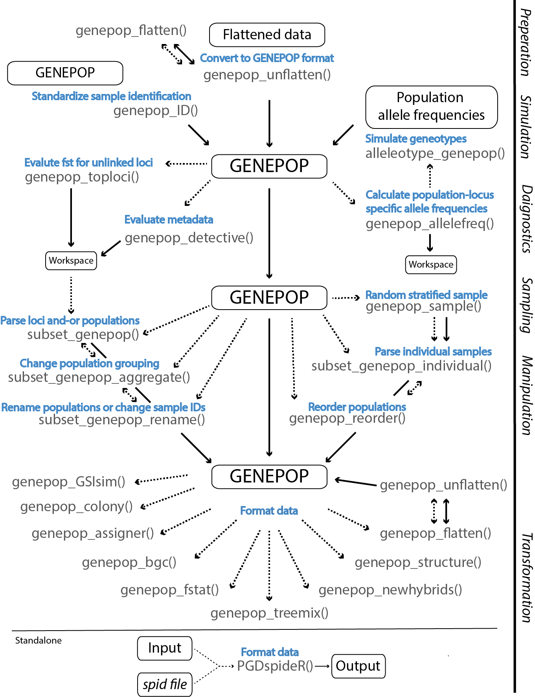

#genepopedit
[](https://travis-ci.org/rystanley/genepopedit)
[](https://ci.appveyor.com/project/rystanley/genepopedit)
[](http://cran.r-project.org/package=genepopedit)
[](https://zenodo.org/badge/latestdoi/19199/rystanley/genepopedit)

The goal of **genepopedit** is to provide a simple and flexible tool for manipulating large multi-locus genotype datasets in R. 

** Note on starting on Aug 3 2016 genepopedit will only accept lowercase input variables. Full changes will be in effect by Aug 5 2016 and on all versions > 1.0.0.5 ** 

**Use genepopedit to subset a SNP dataset by:**

* removing specified loci. 

* removing specified populations. 

* removing specified individuals.

* renaming populations. 

* grouping populations.

* extracting meta-data:
    * population names.
    * population counts.
    * sample IDs.
    * loci names.
    * allele calls.
    * allele frequencies by population grouping.
    * loci linkage and global Weir and Cockerham's Fst. 
    * lists of unlinked loci maximizing pairwise global Weir and Cockerham's Fst.
    
* create datasets for training, assignment, and outlier detection, according to a population stratified random sample. 

* convert Genepop to STRUCTURE, FSTAT, NEWHYBRIDS, ASSIGNER, BGC, TREEMIX, COLONY, Genetic Stock Identification (gsi_sim), and flattened/unflattened format.

* simulate individual genotypes using pooled DNA allele frequencies.


***



__Fig 1.__ **genepopedit** *workflow including data preparation, diagnostics, manipulation and transformation. Files, functions, and function operations are denoted by black, grey and blue text, respectively. Function inputs and outputs are denoted by dashed and solid lines, respectively.*

***
**Requirement:**
genepopedit functions through the manipulation of multi-locus SNP files structured in the *Genepop* file format <http://genepop.curtin.edu.au/>. Specifically, we use the _three number_ format (e.g. 110110) where the six digits correspond to the alleles of a given locus for an individual. Locus names can be listed in the first row separated by columns or each on their own row so that the total number of rows in the _Genepop_ file equals: 

    nrows = nLOCI + nINDIVIDUALS + nPOPULATIONS - 1
    
  _or_
  
    nrows* = nLOCI + nINDIVIDUALS + nPOPULATIONS 
    
_* if STACKS version is not specified_

**For example:**

*A three locus dataset with two populations and four individuals per population with the STACKS version specified*

    STACKS Version 1.0
    Loci_1
    Loci_2
    Loci_3
    Pop
    BON_01  , 120120 110110 110110
    BON_02  , 100100 110110 110110
    BON_03  , 100100 110110 110110
    BON_04  , 100100 110110 110110
    Pop
    TAG_01  , 120120 110110 110110
    TAG_02  , 120120 110110 110110
    TAG_03  , 120120 110110 110110
    TAG_04  , 120120 110110 110110

Alternatively, the loci names can be read in the first row as a single character separated by commas. 

    Loci_1,Loci_2,Loci,3
    Pop
    BON_01  , 120120 110110 110110
    BON_02  , 100100 110110 110110
    BON_03  , 100100 110110 110110
    BON_04  , 100100 110110 110110
    Pop
    TAG_01  , 120120 110110 110110
    TAG_02  , 120120 110110 110110
    TAG_03  , 120120 110110 110110
    TAG_04  , 120120 110110 110110
    
In both formats each row is read in as a single character vector. Sample IDs have the population and sample number separated by a "_". Between sample ID and the loci is conventional Genepop separator "   , " *(space,space space)*. Note if your population label is note separated from the sample number in the Sample IDs refer to the help section for . [ subset\_genpop\_rename ](#subsetrenm)

<span style="color:red"><STRONG> Note </span></STRONG> that input and output "**path**" variables all require the **FULL** file path. Relative paths will not work with _genepopedit_ functions.  

Most molecular based file formats can be converted to and from *Genepop* using conversion programs such as the R package _adegenet_ <https://github.com/thibautjombart/adegenet/wiki> or the program *PGDspider* <http://www.cmpg.unibe.ch/software/PGDSpider/>. 

***

## Installation
You can install **genepopedit** as a R package using the following 2 steps:

**Step 1** Install the _R_ package *devtools*
```r
if (!require("devtools")) install.packages("devtools") # to install
```

**Step 2** Install *genepopedit*:
```r
#install the package from *Github*
devtools::install_github("rystanley/genepopedit") 
library(genepopedit) # load the library
```

<a name="extrainstall"/>
<a name="pgdinstall"/>

**Step 3** Install *PGDspider* and *plink*. Note these programs are required for the use of **genepop_toploc()** and **PGDspideR()** only!

  * PGDspider: <http://www.cmpg.unibe.ch/software/PGDSpider/>
  * plink: <http://pngu.mgh.harvard.edu/~purcell/plink/download.shtml>
  
  
** Note that appveyor build 'failure' is linked to an error in the build check and not *genepopedit* itself. This package has been tested on Windows, Linux (Unbuntu & Mint), and IOS operating systems. **

***

## Contributions:
*genepopedit* was written in collaboration:
  
  * Ryan Stanley <https://github.com/rystanley> - Corresponding developer.
  * Ian Bradbury <https://bradburygeneticslab.com/>
  * Nick Jeffery <https://github.com/NickJeff13>
  * Brendan Wringe <https://github.com/bwringe>

This package has been developed to be used by anyone who is looking for a more efficient and **repeatable** method to manipulate large multi-locus datasets. The package is open, and I encourage you to tinker and look for improvements. I will do my best to respond to any inquiries, add additional functions _and-or_ functionality, and improve the efficiency of the package.

* If you don’t understand something, please let me know: 
(ryan.stanley _at_ dfo-mpo.gc.ca). 
* Any ideas on how to improve the functionality is very much appreciated. 
* If you spot a typo, feel free to edit and send a pull request.

Pull request how-to: 

  * Click the edit this page on the sidebar.
  * Make the changes using github’s in-page editor and save.
  * Submit a pull request and include a brief description of your changes. (e.g. "_spelling errors_" or "_indexing error_").
  
***

#**Citation** 

Full package description and citation now available at **Molecular Ecology Resources** <http://onlinelibrary.wiley.com/doi/10.1111/1755-0998.12569/abstract>

A Zenodo DOI is also avaiable for the most recent release of **genepopedit**:
[](https://zenodo.org/badge/latestdoi/19199/rystanley/genepopedit)

***
#**Diagnostics** <a name="funcdiag"/>

#### genepop_detective.R

* extract quick meta-data from Genepop file
    * Population names
    * Population counts
    * Sample IDs
    * Loci
    * Alleles
    
[_example use_](#genepopdetect)

**Variable name** | **Input**  
--------------|-----------------------------------
**Genepop** | a path to a Genepop file _or_ a dataframe read into the workspace of a Genepop file.  
**variable** | variable to report.

  * variable="Pops" -> returns vector of population names (default)
  * variable="PopNum" -> returns population summary table
  * variable="Loci" -> returns vector of loci names
  * variable="Inds" -> returns vector of Sample IDs
  * variable="All" -> returns an s4 container with "Pops","Loci","Inds" & "PopNum"
  * variable="Allele" -> returns vector of Alleles (*note this might include missing values)
  
#### genepop_allelefreq.R
Calculate allele frequencies (major) for a given set of loci aggregated by population grouping. 

[_example use_](#genepopafreq)

**Variable name** | **Input**  
--------------|-----------------------------------
**Genepop** | a path to a Genepop file _or_ a dataframe read into the workspace of a Genepop file.  
**popgroup** | population grouping using the "Pop" delimiter (Default: NULL) or a dataframe or path to a csv. The grouping dataframe should have two columns, the first corresponding to the population name and the second to an aggregation vector of common groups. Each population can only be assigned to one group.
**Wide** | logical (default: FALSE) defining whether the output should be cast in 'wide' format. Note that 'wide' format is accepted as the input for alleleotype_genepop().

#### genepop_toploci.R
This function will return the the panel with the highest Fst for unlinked loci ordered by Fst. Returned loci have the highest Fst from the _original panel_ and are not linked to any other loci in the _returned panel_. Note this function requires the installation and access to both PGDspider for format conversion & PLINK for linkage calculations. [_See installation instructions here_](#extrainstall)

[_example use_](#genepoptoploc)

**Variable name** | **Input**  
--------------|-----------------------------------
**Genepop** | A path to a Genepop file _or_ a dataframe read into the workspace of a Genepop file.  
**where.plink** | A file path to the PLINK installation folder.
**where.pgdspider** | A file path to the PGDspider installation folder.
**r2.theshold** | Linkage threshold based on correlation between loci. Value must be between 0 & 1. Default: 0.2 matched to PLINK defaults. 
**fst.threshold** | The minimum r^2 threshold to consider a pair of loci to be considered linked (default: 0.05).
**ld.window** | The number of sequential loci to be considered for linkage. This sliding window is based on the input order of loci in the input data. Default (NULL) will calcualte linkage among **all loci**. This variable should not be changed unless the order and proximity of loci on the genome is known and integrated into the order within the input data.
**ldpop** | A string which denotes which of the populations you wish to calculate linkage disequilibrium from. The default is to calculate LD among all ("All") populations. Population names must match those returned by [*genepop_detective*](#genepopdetect).
**allocate.pgd.ram** | An integer defining how many GB of ram will be made available to PGD spider during calculation of LD. Default (1 GB) should be sufficient for most calculations. Note that for Windows based platforms the limitation for PGDspider is ~1 GB. If a value other than default is specified on Windows _allocate.pgd.ram_ will be set to 1 GB.
**return.workspace** | Logical query (default: TRUE) sepecifying whether to return the output to the workspace.
**save.output** | Logical query (default: FALSE) to save the output to the same location as the file being analyzed. Each of the outputs of the function will be saved as a separate file with the file name of the orginal data appended with "Linkages", "Loci-FST", and "Unlinked-Loci-FST" for the pairwise linked loci along with their r^2, all loci with their global Fst, and only the top unlinked loci with their Fst respectively.

***

#**Manipulation** <a name="funcmanip"/>

#### subset_genepop.R 
* remove or keep a subset of loci 
* remove populations 

[_example use_](#subsetgenp)

**Variable name** | **Input**  
--------------|-----------------------------------
**Genepop** | a path to a Genepop file _or_ a dataframe read into the workspace of a Genepop file.
**subs** | vector loci names of interest (default: NULL)
**keep** | logical whether to keep loci specified by subs (default: TRUE) or to keep remaining loci.
**sPop** | populations to be retained (default: NULL).
**path** | the filepath & filename of output.

#### subset_genepop_rename.R
* subset and-or rename populations

[_example use_](#subsetrenm)

**Variable name** | **Input**  
--------------|-----------------------------------
**Genepop** | a path to a Genepop file _or_ a dataframe read into the workspace of a Genepop file.
**nameframe** | a dataframe or path to a csv detailing the original and any edited population names or sampleIDs.
**renumber** | logical (default: FALSE) whether the sample numbers are to be replaced. 
**meta** | character defining which meta information is being edited. Options are "Pop" (default) or "Ind" for populations or sampleIDs respectively. This parameter must be specified.
**path** | the filepath & filename of output.

#### subset_genepop_aggregate.R
* group populations based on Genepop population tags

[_example use_](#subsetagg)

**Variable name** | **Input**  
--------------|-----------------------------------
**Genepop** | a path to a Genepop file _or_ a dataframe read into the workspace of a Genepop file.
**subs** | vector loci names of interest (default: NULL)
**keep** | logical whether to keep loci specified by subs (default: TRUE) or to keep remaining loci.
**agPopFrame** | a dataframe or path to a csv detailing the population names & populations to be aggregated.
**path** | the filepath & filename of output.

#### subset_genepop_individuals.R
* remove or keep a subset of individuals

[_example use_](#subsetidv)

**Variable name** | **Input**  
--------------|-----------------------------------
**Genepop** | a path to a Genepop file _or_ a dataframe read into the workspace of a Genepop file.
**indiv** | vector sample IDs of interest.
**keep** | logical whether to delete sample IDs specified by indiv (default: TRUE) or delete all other IDs.
**path** | the filepath & filename of output.

#### genepop_ID.R
* function to add '_' between the population and sample number of a sample ID. This format (e.g. BON_01) is required for the remaining genepopedit functions. If your data already fits this format then this function need not be used. 

[_example use_](#genepopidfix)

**Variable name** | **Input**  
--------------|-----------------------------------
**Genepop** | a path to a Genepop file _or_ a dataframe read into the workspace of a Genepop file.
**path** | the filepath & filename of output.

***

#**Simulation** <a name="pooleddna"/>

#### alleleotype_genepop.R
* A tool to simulate individual genotypes using pooled sequencing allele frequencies and randomization.

[_example use_](#pooldna)

**Variable name** | **Input**  
--------------|---------------------------------
**input** | complete file path to the input file to be converted or an object in the workspace. The first column should denote populations and adjacent columns the allele frequency (major or minor) for each loci (named in the column header).
**numsim** | the number of simulated individuals to be returned per population (default: 100). 
**path** | the filepath & filename of output.

***

#**Sampling** <a name="funcsamp"/>

#### genepop_sample.R 
* Subsample individuals from a genepop file using population based random stratified sampling.

[_example use_](#genepopsamp)
  
**Variable name** | **Input**  
--------------|---------------------------------
*Genepop* | a path to a Genepop file _or_ a dataframe read into the workspace of a Genepop file
*nsample*| object which defines sampling.

  * nsample (integer) -> (e.g. nsample = 5) nsample will be sampled at random from each strata (population).
  * nsample (fraction) -> (e.g. nsample = 0.5) a fraction will be sampled at random from each strata (population).
  * nsample (integer per population) -> (e.g. number varying per population) nsample (column 2) will be sampled at random from each strata (column 1 population).
  * nsample (fraction per population) -> (e.g. fraction varying per population) a fraction (column 2) will be sampled at random from each strata (column 1 population).

***

#**Transformation** <a name="funcconvert"/>

#### genepop_structure.R 
* Convert Genepop format to NewHybrids format.
  <http://pritchardlab.stanford.edu/structure.html>
  
[_example use_](#genepopstruc)
  
**Variable name** | **Input**  
--------------|---------------------------------
**Genepop** | a path to a Genepop file _or_ a dataframe read into the workspace of a Genepop file.
**popgroup** | popgroup is a dataframe or path to a csv. column one specifies the population and column two has the numeric grouping. If NULL (default) then population levels will be assigned an individual group.
**path** | the filepath & filename of output.

#### genepop_fstat.R 
* Convert Genepop format to fstat format.
<https://cran.r-project.org/web/packages/hierfstat/index.html>

[_example use_](#genepopfst)
  
**Variable name** | **Input**  
--------------|---------------------------------
**Genepop** | a path to a Genepop file _or_ a dataframe read into the workspace of a Genepop file
**path** | the filepath & filename of output.
**addworkspace** | logical to specify whether to save fstat conversion to path (default) or to workspace as Output_fstat object.

#### genepop_newhybrids.R 
* Convert Genepop format to NewHybrids format.
  <http://ib.berkeley.edu/labs/slatkin/eriq/software/software.htm#NewHybs>
  
[_example use_](#genepopnh)
  
**Variable name** | **Input**  
--------------|---------------------------------
**Genepop** | a path to a Genepop file _or_ a dataframe read into the workspace of a Genepop file
**path** | the filepath & filename of output.

#### genepop_assigner.R 
* Convert Genepop format to assigner format.
<https://github.com/thierrygosselin/assigner>

[_example use_](#genepopagn)
  
**Variable name** | **Input**  
--------------|---------------------------------
**Genepop** | a path to a Genepop file _or_ a dataframe read into the workspace of a Genepop file.
**popgroup** | popgroup is a dataframe or path to a csv. column one specifies the population and column two has the numeric grouping. If NULL (default) then population levels will be assigned an individual group.
**path** | the filepath & filename of output.

#### genepop_colony.R 
* Convert Genepop from GENEPOP file to the input files (2) required by Colony.
<https://www.zsl.org/science/software/colony>

[_example use_](#genepopcolony)
  
**Variable name** | **Input**  
--------------|---------------------------------
**Genepop** | a path to a Genepop file _or_ a dataframe read into the workspace of a Genepop file.
**where.pgdspider** | A file path to the PGDspider installation folder.
**where.plink** | A file path to the PLINK installation folder.
**denote.missing** | The value that denotes missing data in your input file (default: "000").
**allocate.pgd.ram** | An integer defining how many GB of ram will be made available to PGD spider during calculation of LD. Default (1 GB) should be sufficient for most calculations. Note that for Windows based platforms the limitation for PGDspider is ~1 GB. If a value other than default is specified on Windows _allocate.pgd.ram_ will be set to 1 GB.
**path** | file path to directory where the Colony files (4) will be saved.

#### genepop_bgc.R 
* Convert Genepop format to Bayesian Genomic Clines (BGC) format (3 files).
<https://sites.google.com/site/bgcsoftware/>

[_example use_](#genepopbgc)
  
**Variable name** | **Input**  
--------------|---------------------------------
**Genepop** | a path to a Genepop file _or_ a dataframe read into the workspace of a Genepop file.
**popdef** | popgroup is a dataframe or path to a csv. This dataframe contains two columns. Column 1 corresponds to the population names. The next column has the grouping classification corresponding to each population defining parental 1 ("P1") parental 2 ("P2") and admixed ("Admixed") populations.
**fname** | collective name assigned to each output the output files (3).
**path** | the path to directory where the BGC files will be saved.

#### genepop_treemix.R 
* Convert Genepop format to a gzipped Treemix input file.
<https://bitbucket.org/nygcresearch/treemix/wiki/Home>

[_example use_](#genepoptreemix)
  
**Variable name** | **Input**  
--------------|---------------------------------
**Genepop** | a path to a Genepop file _or_ a dataframe read into the workspace of a Genepop file.
**where.pgdspider** | A file path to the PGDspider installation folder.
**where.plink** | A file path to the PLINK installation folder.
**allocate.pgd.ram** | An integer defining how many GB of ram will be made available to PGD spider during calculation of LD. Default (1 GB) should be sufficient for most calculations. Note that for Windows based platforms the limitation for PGDspider is ~1 GB. If a value other than default is specified on Windows _allocate.pgd.ram_ will be set to 1 GB.
**keep_inter** | A logical vector specifying whether the intermediate conversion steps (.map,.ped, and clustering file) should be returned to the path.
**path** | the path to directory where the TREEMIX files will be saved.

#### genepop_GSIsim.R 
* Convert Genepop format to the format required for Genetic Stock Identification analysis (GSI)
<https://swfsc.noaa.gov/textblock.aspx?Division=FED&ParentMenuId=54&id=12964>

[_example use_](#genepopgsi)
  
**Variable name** | **Input**  
--------------|---------------------------------
**Genepop** | a path to a Genepop file _or_ a dataframe read into the workspace of a Genepop file.
**path** | the filepath & filename of output.

#### genepop_flatten.R 
* Convert Genepop format to a flattened dataframe:
    * Sample IDs
    * Population
    * Sample number
    * Loci
    
[_example use_](#genepopflat)

**Variable name** | **Input**  
--------------|---------------------------------
**Genepop** | a path to a Genepop file _or_ a dataframe read into the workspace of a Genepop file

#### genepop_unflatten.R 
* Convert flattened dataframe to genepop format:

[_example use_](#genepopunflat)

**Variable name** | **Input**  
--------------|---------------------------------
**df** | data.frame object in workspace. First column is the sampleID (e.g. "BON_01") the remaining columns are Loci. 
**path** | the filepath & filename of output.

***

### Conversion using PGDspider <a name="funcpgd"/>

We have developed an _R_ interface for PGDspider <http://www.cmpg.unibe.ch/software/PGDSpider/>. This function will enable R to interact with PGDspider to convert among file formats not included in **genpopedit** conversion functions. Currently this is best accomplished using the .spid files generated by PGDspider to define the conversion process. Once a .spid file is created, **genepopedit** can continue to convert files provided the conversion parameters in the .spid file match those required for the conversion. This program will require installation of PGDspider. [_See installation instructions here_](#pgdinstall)

#### PGDspideR.R
* call conversion tools of pgdSpider through R

[_example use_](#pgdspiderConvert)

**Variable name** | **Input**  
--------------|---------------------------------
**input** | complete file path to the input file to be converted. 
**input_format** | format of the input file. This format should match the dropdown menus of pgdSpider in terms of spelling and capitalization (e.g. GENEPOP & FSTAT).
**output** | complete file path to the defining where the converted file will be stored.
**output_format** | format of the of the converted file. This format should match the dropdown menus of pgdSpider in terms of spelling and capitalization (e.g. GENEPOP & FSTAT).
**spid** | complete file path to the .spid file created by pgdSpider defining the conversion between input_format and output_format. Note that parameters of this .spid file must match the conversion and input file as specified by pgdSpider.
**where.pgdspider** | the filepath to the folder where pgdSpider installation files are stored.

***

#**How to use genepopedit**

Example data for the use in the following documentation is included within genepopedit. 
The example genepop data is a GenePop data format with 10 populations, 30 individuals per population, and 100 Loci.

```r
#Load example data in your workspace. 'GenePopData' will now be available for use.
  data("ExampleGenePop")
```
If reading in data to your workspace use the following *read.table* code specifics and associated parameters (sep="\t",quote="",stringsAsFactors=FALSE)

```r
#Example file path to your data
  file.link <- "c:/Users/YOUR NAME/Documents/Data/genepopdata.txt"

#If your dataset has fewer than ~15,000 loci *read.table* should suffice
  GenePop <- read.table(file.link,sep="\t",quote="",stringsAsFactors=FALSE)

#If your dataset has a large amount of loci (>15,000) then we suggest using the data.table package to load in the data more efficiently.
  GenePop <- data.table::fread(file.link,header=FALSE, sep="\t",stringsAsFactors=FALSE)
```

However, reading in your GENEPOP data into the workspace is not required, as all functions can work with both workspace objects *and* **file paths**.

```

Set a directory where the output files will be saved.

```r
output_dir <- "c:/Users/YourName/Documents/GenePopFiles/" 
```

***

#**Preparation** <a name="genepopidfix"/>

##genepop\_ID
Functions available in **genepopedit** require that the population and sample number be separated by an _ in the sample ID (e.g. BON_01 not BON01). This can be accomplished manually using a text editor or using the function **genepop_ID**. genepop_ID will read in a Genepop file and look for a common character string within the sample ID vectors grouped by the Genepop "Pop" labels. This function assumes that there _is_ a common string which unifies IDs between each of the Pop labels. If this isn't the case, some pre-filtering of the data using a text editor will be required. [_Function description_](#funcmanip)

```r
#Use genepop_ID to fix the sample IDs prior to the use of genepopedit functions.
filepath="~myfile.txt" #path to 'myfile' which has sample IDs without the required _ separation. Note this can also be an object in the workspace.

genepop_ID(GenePop=filepath, path=paste0(output_dir,"Genepop_SampleID_fixed.txt"))
```

***

#**Diagnostics**

<a name="genepopdetect"/>
##genepop\_detective
This function queries meta-data from your genepop data without having to open it in a text editor. Function returns a vector of population names, population counts, sample IDs, or Loci names. [_Function description_](#funcdiag)

Return *population names*
```r
PopNames <- genepop_detective(GenePopData, variable="Pops")
```
Return *population counts*
```r
PopCounts <- genepop_detective(GenePopData, variable="PopNum")
```
Return *sample IDs*
```r
SampleIDs <- genepop_detective(GenePopData, variable="Inds")
```
Return *Loci names* using the file path instead of the workspace object.
```r
LociNames <- genepop_detective("genepopedit_examplefile.txt",variable="Loci")
```
Return *All* using the file path instead of the workspace object.
```r
metadata <- genepop_detective("genepopedit_examplefile.txt",variable="All")
metadata$Pops #Populations
metadata$Loci #Loci names
metadata$Inds #Individual IDs
metadata$PopNum #Population counts
```

Return *Allele values* using the file path instead of the workspace object.
```r
Alleles <- genepop_detective("genepopedit_examplefile.txt",variable="Allele")
```
<a name="genepopafreq"/>
##genepop\_allelefreq
This function will calculate allele frequencies based on the major allele among populations for each population group. [_Function description_](#funcdiag)

```r
#calculate major allele frequencies according to the default population groupings.
  AlleleFreq_default <- genepop_allelefreq(GenePopData)

#calculate major allele frequencies according to the specified population groupings.
  popgrouping <- data.frame(Name=c("AAA","BBB","CCC","DDD","EEE","FFF"),groups=c("gr1","gr1","gr2","gr2","gr3","gr3"))

  AlleleFreq_specified <- genepop_allelefreq(GenePopData, popgroup=popgrouping)
```

<a name="genepoptoploc"/>
##genepop\_toploci
This function will calculate linkage disequilibrium and global Weir and Cockerham's Fst for loci among populations. The function seeks a loci panel which maximizes global Fst for unlinked loci. The returned object is a list containing Linked loci ($Linked), global FST ($FST) and the top unlinked loci by FST ($FST_Unlinked). Note 'linked' loci are calcuated based on the threshold R<sup>2</sup> of 0.2 used by PLINK. This threshold (0-1) can be adjusted, though values <0.2 may be limited by computational resources. Note that the available RAM for conversions using PGDspider is limited to 1 GB on Windows based operating systems. [_Function description_](#funcdiag)

**Warning messages & daignostics will be returned to the console by PGDspider & PLINK. These warnings are expected.** 

```r

#Evaluate Fst and linkage among all loci and return an unlinked panel optimized by global Fst. 
#To calculate LD we use PLINK which requires a file conversion using PGDspider. 

  TopLoci <- genepop_toploci(GenePop="genepopedit_examplefile.txt",
  where.plink="c:/Users/YOURNAME/Documents/Programs/plink/",
  where.pgdspider="c:/Users/YOURNAME/Documents/Programs/PGDSpider_2.0.9.0/" )
  
#Linked loci
  TopLoci$Linked
  
#Loci FST among populations
  TopLoci$FST
  
#Maximized FST by unlinked loci
  TopLoci$FST_Unlinked
  
```
*** 

#**Manipulation**

<a name="subsetgenp"/>
##subset\_genepop
Create a new Genepop file which only contains Loci *3, 15, 23, 49, 62, 81, 88, & 94*. This useful if, for example, you identify loci which are potentially under selection and want a parsed dataset. Here our loci are named in the Loci# (1:100). [_Function description_](#funcmanip)

```r
#inspect the names of the loci within the Genepop data
  genepop_detective(GenePopData,"Loci")

#subset the Genepop file and 'keep' the specified loci names.
  subloci <-c("Loci03","Loci15","Loci23","Loci49","Loci62","Loci81","Loci88","Loci94")
  
  subset_genepop(GenePop = GenePopData, keep = TRUE, subs = subloci, path = paste0(output_dir,"Genepop_Loci_selection.txt"))
```

You can also choose all loci not in the vector specified using keep = FALSE.

```r
#subset the Genepop file and do not 'keep' the specified 'subs'
  subset_genepop(GenePop = GenePopData, keep = FALSE, subs = subloci, path = paste0(output_dir,"Genepop_Loci_neutral.txt"))
```

You can also remove populations within this function. Here we again select loci under selection, but remove populations 3 & 7 (CCC/GGG). To do this we create a list of all populations we want to keep
(e.g. AAA, BBB, CCC ... JJJ)

```r
#use genepop_detective to find the population names
  PopNames <- genepop_detective(GenePopData,"Pops")

#create a list of populations you want to keep
  #manual
  PopKeep <- c("AAA","BBB","DDD","EEE","FFF","HHH","III","JJJ")
#or
  #if you have fewer pops to remove
  PopKeep <- setdiff(PopNames, c("CCC","GGG"))
  
  #vector of loci to keep
  subloci <- c("Loci03","Loci15","Loci23","Loci49","Loci62","Loci81","Loci88","Loci94")
  
  subset_genepop(GenePop = GenePopData, keep = TRUE, subs = subloci, sPop = PopKeep, path = paste0(output_dir,"Genepop_Loci_selection_subpop.txt"))
```
<a name="subsetrenm"/>
##subset\_genepop\_rename
Now change the names of some of the populations. In this example we will rename populations DDD & HHH to YYY & ZZZ. [_Function description_](#funcmanip)

```r
#view the population names
  genepop_detective(GenePopData,"Pops")

#create a dataframe for renaming. 
#column 1 = the original pop names.
#column 2 = the new names. 
  PopRename <- data.frame(oPop = c("AAA","BBB","CCC","DDD","EEE","FFF","GGG","HHH","III","JJJ"),
  newname = c("AAA","BBB","CCC","YYY","EEE","FFF","GGG","ZZZ","III","JJJ"))

#rename populations
  subset_genepop_rename(GenePop = GenePopData, path = paste0(output_dir,"Genepop_renamed.txt"),nameframe = PopRename)
```

Populations can also be grouped by a common name. The result is similar to subset-genepop-aggregate except that population names will be replaced. Here it is useful to enable renumbering (renumber = TRUE) or there individuals with the same number will be assigned the same ID, if populations are combined. 

```r
#view the population names
  genepop_detective(GenePopData,"Pops")

#create a dataframe for renaming. 
#column 1 = the original pop names.
#column 2 = the new names. 
  PopRename_group <- data.frame(oPop = c("AAA","BBB","CCC","DDD","EEE","FFF","GGG","HHH","III","JJJ"),newname = c("Pop1","Pop1","Pop1","Pop1","Pop1","Pop2","Pop2","Pop2","Pop2","Pop2"))

#rename populations
  subset_genepop_rename(GenePop = GenePopData, nameframe = PopRename_group, renumber = TRUE, meta="Pop",path = paste0(output_dir,"Genepop_renamed_renumbered.txt"))
```

Alternatively the sampleIDs can be renamed directly. 
```r
#create a renaming vector (column 1 = old column 2 = new)
  IndRename_group <- data.frame(new = c("AAA_10","BBB_10","CCC_10","DDD_10"),old = c("AAA_99","BBB_99","CCC_99","DDD_99"))

#rename sampleIDs
  subset_genepop_rename(GenePop = GenePopData, nameframe = IndRename_group, meta="Ind",path = paste0(output_dir,"Genepop_ID_renamed.txt"))
```

If your sample IDs are not split between the population and the sample number using an _ then you can rename the populations before using any subsetting functions. Note that in this example because there is already a _ separating populations the 

```r
#view the sample IDs
PopNames <- genepop_detective(GenePopData,"Inds")
PopNames_fixed <- paste0(PopNames,"_") #add the underscore seperator

#create a dataframe for renaming. 
  PopRename_fixed <- data.frame(oPop = PopNames, newname = PopNames_fixed)

#rename populations * note here you will keep the original sample #s (renumber = F)
  subset_genepop_rename(GenePop = GenePopData, path = paste0(output_dir,"Genepop_renamed_renumbered.txt"),nameframe = PopRename_fixed, renumber = FALSE)
```

<a name="subsetagg"/>
##subset\_genepop\_aggregate
Now lets change group some populations together. In this example we will combine populations DDD/EEE & FFF/HHH and remove populations JJJ/GGG (*not listed in column 1 of PopRename*). No loci will be removed from this dataframe (*subs = NULL*). This is useful when you don't want a clustering program (e.g. STRUCTURE or Bayescan) to assume differences among population groups. [_Function description_](#funcmanip)

```r
#Use genepop_detective to find the meta-data for populations
  genepop_detective(GenePopData,"Pops")

#create a dataframe for renaming. 
#column 1 = the original pop names and the list of pops required.
#column 2 = Grouping variables. 
  PopAggregate <-data.frame(oP = c("AAA","BBB","CCC","DDD","EEE","FFF","HHH","III"),
  agname = c("AAA","Pop1","CCC","Pop1","DDD","Pop2","HHH","Pop2"))

#re-cast Genepop format to group populations based on 'PopAggregate'
  subset_genepop_aggregate(GenePop = GenePopData, subs = NULL, path = paste0(output_dir,"Genepop_grouped.txt"),agPopFrame = PopAggregate)
```

Now that we have two grouped populations, we can use the population rename function to give them a common name.

```r
#read in the grouped Genepop file
  GenePopData2 <-read.table(paste0(output_dir,"Genepop_grouped.txt"),header = FALSE, sep = "\t", quote = "", stringsAsFactors = FALSE)

#investigate the population parameters
  genepop_detective(GenePopData2,"Pops")

#we can see that "BBB" & "DDD" and "FFF" & "III" are at the end but still have different names. 

#create renaming frame
  PopRename <- data.frame(oPop = c("AAA","CCC","EEE","HHH","BBB","DDD","FFF","III"),
  newname = c("AAA","CCC","EEE","HHH","Group1","Group1","Group2","Group2"))

#Rename the grouped populations
  subset_genepop_rename(GenePop = GenePopData2, nameframe = PopRename, path = paste0(output_dir,"Genepop_grouped_renamed.txt"))
                 
                 
```
<a name="subsetidv"/>
##subset\_genepop\_individual
Remove some individual samples from the dataframe. Here we consider the 'individual' ID to be an alpha-numeric code which at the start of each row of data. The keep parameter defines whether the specified list is removed or retained (default: keep = FALSE).
_This function is best run at the beginning of the analysis prior to removal of specific loci or populations._ [_Function description_](#funcmanip)

```r
#Use genepop_detective to see the naming structure.
  genepop_detective(GenePopData,"Inds")

#vector of sample IDs to remove
  subid <- c("AAA_1","AAA_3","BBB_20","CCC_21","EEE_3","EEE_26","HHH_25","JJJ_4")

  subset_genepop_individual(GenePop = GenePopData, indiv = subid, keep = FALSE, path = paste0(output_dir,"Genepop_IDsubset.txt"))
```

***

#**Sampling**

<a name="genepopsamp"/>
##genepop\_sample
Function which will allow you to create subsets of the genepop. This might be useful for creating training and leave-out datasets for assignment. [_Function description_](#funcsamp)

```r
#view how many individuals you have in each population
  genepop_detective(GenePopData,"PopNum")
```
There are several ways we can sub-sample each population

Use a fixed number (e.g. 5 from each population)
```r
  SubSamp <- genepop_sample(GenePopData, nsample = 5)
```

*or*


Use a fixed fraction (e.g. 25% from each population)
```r
  SubSamp <- genepop_sample(GenePopData, nsample = 0.25)
```

*or*

Use a fraction which varies for each population
```r
#vector of populations in the Genepop file
  Pops <- genepop_detective(GenePopData,"Pops")

#create a dataframe which defines how many you want to sample from each population. Note here we create a column which has an entry for each population.
  subdf <- data.frame(Pops = Pops, nsample = c(5, 2, 3, 5, 6, 5, 2, 3, 5, 6))

  SubSamp <- genepop_sample(GenePopData, nsample = subdf)
```

*or*

Use a fraction which varies for each population
```r
#vector of populations in the Genepop file
  Pops <- genepop_detective(GenePopData,"Pops")

#create a dataframe which defines how many you want to sample from each population. Note here we create a column which has an entry for each population.
  subdf <- data.frame(Pops = Pops, nsample = c(5, 2, 3, 5, 6, 5, 2, 3, 5, 6)/10)

  SubSamp <- genepop_sample(GenePopData, nsample = subdf)
```

Once you select a method to sub-sample each population, you can use the function subset-genepop-indiv to create the sampled genepop file.

For example if you wanted to create a training and assignment dataset  in genepop format using the random stratified sampled we selected using subset-genepop-indiv:

```r
#Create training dataset (keep = TRUE)
  subset_genepop_individual(GenePopData, indiv = SubSamp, keep = TRUE, path = paste0(output_dir,"Genepop_training.txt"))

#Create an assignment dataset using the remaining individuals (keep = FALSE)
  subset_genepop_individual(GenePopData, indiv = SubSamp, keep = FALSE, path = paste0(output_dir,"Genepop_assignment.txt"))
```

***

#**Conversion**

<a name="genepopstruc"/>
##genepop\_structure
If you are interested in investigating population structure you can convert your modified Genepop object or path to saved file directly into a STRUCTURE formatted text (.str) file <http://pritchardlab.stanford.edu/structure.html>. [_Function description_](#funcconvert)

```r
#convert Genepop format to STRUCTURE to default groupings
  genepop_structure(GenePop="Genepop_IDsubset.txt"path = paste0(output_dir,"Sturcture_IDsubset_groups.txt")
  
# Specify population groupings (group CCC/DDD/EEE and III/JJJ)
  pGroups <- data.frame(pops = c("AAA","BBB","CCC","DDD","EEE","FFF","GGG","HHH","III","JJJ"),groups = c("1","2","3","3","3","4","5","6","7","7"))

#convert Genepop format to STRUCTURE with new groupings
  genepop_structure(GenePop="Genepop_IDsubset.txt",popgroup = pGroups, path = paste0(output_dir,"Sturcture_IDsubset_groups.txt"))

```
<a name="genepopfst"/>
##genepop\_fstat

If you are interested in doing calculating gene diversities and-or F-statistics with the cleaned loci datasets, you can convert from Genepop to FSTAT format 
This data can be used by the R package 'hierfstat' <https://cran.r-project.org/web/packages/hierfstat/index.html> or the program 'FSTAT' <http://www2.unil.ch/popgen/softwares/fstat.htm> [_Function description_](#funcconvert)

```r
#convert Genepop format to FSTAT (.dat)
  genepop_fstat(GenePop="Genepop_IDsubset.txt",path = paste0(output_dir,"Fstat_IDsubset.dat"))

#convert Genepop format to FSTAT but keep the data in the workspace
  genepop_fstat(GenePop="Genepop_IDsubset.txt",addworkspace = TRUE)
```
<a name="genepopnh"/>
##genepop\_newhybrids
If you are interested in testing for hybridization you can convert from Genepop to the format necessary for the program New Hybrids <http://ib.berkeley.edu/labs/slatkin/eriq/software/software.htm#NewHybs>. [_Function description_](#funcconvert)

```r
#convert Genepop format to New Hybrids format (.txt)
  genepop_newhybrids(GenePop="Genepop_IDsubset.txt",path = paste0(output_dir,"NewHybrids_IDsubset.txt"))
```
<a name="genepopagn"/>
##genepop\_assigner
If you are interested conducting assignment analysis, you can convert to the format required for the R package "assigner" <https://github.com/thierrygosselin/assigner>. [_Function description_](#funcconvert)

```r
#convert Genepop format to assigner format (.txt) using the populations each as their own assessment level
  genepop_assigner(GenePop="Genepop_IDsubset.txt",path = paste0(output_dir,"assigner_IDsubset.txt"))
  
# Set new population assignment groupings (group CCC/DDD/EEE and III/JJJ)
  pGroups <- data.frame(pops = c("AAA","BBB","CCC","DDD","EEE","FFF","GGG","HHH","III","JJJ"),groups = c("1","2","3","3","3","4","5","6","7","7"))
   
   genepop_assigner(GenePop="Genepop_IDsubset.txt",popgroup = pGroups, path = paste0(output_dir,"assigner_IDsubset_NewGroups.txt"))
  
```
<a name="genepopcolony"/>
##genepop\_colony
If you are interested in investigating sibship or parentage, you can convert to the format required for the software Colony. Returned are functions for translating the Colony output and those required by the maximum likelihood analysis. 'Individual' and 'Loci' conversion files can be used to match the loci and individual names formatted for input to Colony to those provided as input by the user.'MarkerTypeErrorRT' file defines the allele dropout rates as calculated using the 'missing' function in PLINK. Rates of other error types are assumed to be equal to the estimated allele dropout rates. 'GENOTYPES' are the geneotypes in two columns per loci format. Output from Colony is based on the input for of the 
 'GENOTYPES' file. Original loci and individual names can be assigned using the conversion output files. All files are returned to path and are named according tot he input filename. <https://www.zsl.org/science/software/colony>. [_Function description_](#funcconvert)


```r
#convert Genepop format to the files necessary for Colony 
  genepop_colony(GenePop="Genepop_IDsubset.txt",where.plink="c:/Users/YOURNAME/Documents/Programs/plink/",where.pgdspider="c:/Users/YOURNAME/Documents/Programs/PGDSpider_2.0.9.0/",denote.missing = "000",path = output_dir)
  
```

<a name="genepopbgc"/>
##genepop\_bgc
**genepopedit** is one of the few tools available to convert data to the format required for input into to the "Bayesian estimation of Genomic Clines" (BGC) format. BGC can evalute genomic clinal patterns and introgression among loci. To convert to BGC format you must specify which populations you consider to be ancestral or **parental** (P1, P2) and which you assume could be hybridized (**admixed**). <https://sites.google.com/site/bgcsoftware/>. [_Function description_](#funcconvert)

```r
#specify which populations are going to be included in the analysis and to which class they belong. Note Pops identified in P1 and-or P2 can also be specified as "Admixed" to test BGC output. 
  BGC_groups = data.frame(pops = c("AAA","BBB","CCC","DDD","EEE","FFF","GGG","HHH","III","JJJ"),groups = c("P1","P1","P1","Admixed","Admixed","Admixed","Admixed","P2","P2","P2"))

#convert Genepop to BGC input files (3). Note in this case the variable path is a path to the directory where the input files will be saved.
  genepop_bgc(GenePop="Genepop_IDsubset.txt",popdef = BGC_groups, fname="BGC_IDsubset",path = output_dir)

```
<a name="genepoptreemix"/>
##genepop\_treemix
**genepopedit** is one of the few tools available to convert data to the format required for input into the Treemix format. It creates a gzipped file that clusters your individuals based on the population ID of the individual's code. Population IDs are extracted using the "_" to differentiate population from sample ID (e.g. BON_01 is population BON sample 01). If samples are not separated refer to [_genepop_ID_](#genepopidfix). Grouping levels for populations can also be changed using [_subset_genepop_rename_](#subsetrenm). Note that this is just the first of two steps in the process; the gzipped output from this function needs to be run through the Python script (Python 2.7+ must be installed first) that accompanies Treemix. This output from "plink2treemix.py" is then ready to run in Treemix. This Python script can be downloaded from <https://bitbucket.org/nygcresearch/treemix/downloads>.  Treemix is used to infer migration weight and directionality among your populations, as well as detecting population splits and mixtures <https://bitbucket.org/nygcresearch/treemix/wiki/Home>. [_Function description_](#funcconvert)

```r

#convert Genepop to Treemix input and keep intermediary conversion files (default: FALSE)
  genepop_treemix(GenePop="Genepop_IDsubset.txt",where.plink="c:/Users/YOURNAME/Documents/Programs/plink/",where.pgdspider="c:/Users/YOURNAME/Documents/Programs/PGDSpider_2.0.9.0/",keep_inter = TRUE, path = paste0(output_dir,"Treemix_IDsubset.txt"))

```
<a name="genepopgsi"/>
##genepop\_GSIsim
If you are interested in assessing the accuracy of a genetic stock identification analysis, given a genetic baseline, you can convert directly from GENEPOP to a GSI_sim formatted text file. **genepopedit** is among the few tools currenlty available to format data for GSI_sim.  <https://swfsc.noaa.gov/textblock.aspx?Division = FED&ParentMenuId = 54&id = 12964> [_Function description_](#funcconvert)

```r

#convert Genepop to GSIsim format
  genepop_GSIsim(GenePop="Genepop_IDsubset.txt",path = paste0(output_dir,"GSIsim_IDsubset.txt"))

```

<a name="genepopflat"/>
##genepop\_flatten
Flatten your geneotype data for other calculations. This function will convert and return the genepop format into a dataframe. Because this function returns the dataframe, it needs to be assigned a variable ID. Note that this function does not have any subsetting capabilities. If you would like to remove loci and-or populations, this must be before hand using *subset_genepop* or its sister functions (see below for examples). [_Function description_](#funcconvert)

```r
#Flatten the dataframe
  GenePop_df<- genepop_flatten(GenePopData)

#inspect the output for the first 10 columns 
  head(GenePop_df[,1:10])
```
<a name="genepopunflat"/>
##genepop\_unflatten
If you are working with a flattened dataframe in your workspace you can convert it back to Genepop format. **Note that the first column of this data.frame should correspond to the sampleID (e.g. "BON_01") and the remaining columns should be Loci. [_Function description_](#funcconvert)

```r
## remove the "Population" "SampleNum" exported by genepop_flatten
flat.df <- GenePop_df[,-c(2,3)]

# create a Genepop format which can be used by other genepopedit functions
genepop_unflatten(flat.df, path = paste0(output_dir,"GenePop_UNFLATTENED.txt"))
```

#**Conversion using PGDspider**

<a name="pgdspiderConvert"/>
##PGDspideR
There are a broad range of data formats which can be converted to and from using PGDspider. If you have multiple files which you are going to be converting using the same conversion parameters, _PGDspideR.R_ can be useful, providing a code based interface to exploit the conversion functions of PGDspider. [_Function description_](#funcpgd)
```r
#convert between GENEPOP and FSTAT format using PGDspider
  pgdSpideR(input = paste0(output_dir,"Genepop_IDsubset.txt"),
  input_format="GENEPOP",
  output = paste0(output_dir,"Genepop_IDsubset_FSTAT.dat",
  output_format="FSTAT",
  spid="c:/Users/YOURNAME/Documents/spids/GENEPOP_FSTAT.spid",
  where.pgdspider="c:/Users/YOURNAME/Documents/Programs/PGDSpider_2.0.9.0/")

```

#**Simulate genotypes using pooled DNA allele frequencies**

<a name="pooldna"/>
##alleleotype_genepop()
Individual geneotypes can be simulated using the _alleleotype_genepop()_ function and formatted to GENEPOP for use in conventional genomic analyses (e.g. assigner, DAPC, STRUCTURE). This function will simulate individuals for each population provided by the input file. The output can then be diagnosed, sampled, and formatted using other **genepopedit functions**. [_Function description_](#pooleddna)

```r
#simulate individual geneotypes allele frequencies stratified by population.
  #Create an example pooled DNA input file
    pooledDNA <- data.frame(Pop = c("Pop1","Pop2","Pop3","Pop4","Pop5"),Loci1 = round(runif(5, 0, 1),2),Loci2 = round(runif(5, 0, 1),2),Loci3 = round(runif(5, 0, 1),2),Loci4 = round(runif(5, 0, 1),2),Loci5 = round(runif(5, 0, 1),2),Loci6 = round(runif(5, 0, 1),2))
    
    #inspect the input
    pooledDNA

  #simulate 200 individual geneotypes for each population
    alleleotype(pooledDNA, numsim = 200, path = paste0(output_dir,"SimulatedGeneotypes.txt"))
  
  #To validate output simulate 100 (default) geneotypes per population and compare allele frequencies to those of the input file. Estimated frequencies per population and SNP should match those of the input file within +/- 1%.
  
    alleleotype_genepop(pooledDNA, numsim = 100, path = paste0(output_dir,"SimulatedGeneotypesValidate.txt"))
   
    genepop_allelefreq(paste0(output_dir,"SimulatedGeneotypesValidate.txt"))
    
  #Note you can simulate new geneotypes using the summary from genepop_allelefreq(... , Wide = TRUE).
    GeneFreq <- genepop_allelefreq("Genepop_IDsubset.txt",Wide = TRUE)
    
    alleleotype_genepop(GeneFreq, numsim = 100, path = paste0(output_dir,"SimulatedGeneotypes_Genepop_IDsubset.txt"))
  
  
```
